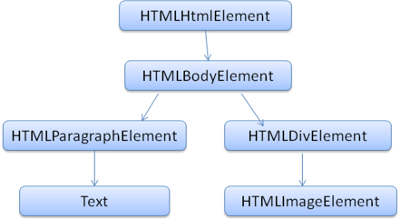

## 面向前端的浏览器

> [浏览器所有](http://www.html5rocks.com/en/tutorials/internals/howbrowserswork/)

通过对这边文字的学习,基本上可以理解浏览器了,对于前端工程师而言,对其中的底层知识,可先暂时搁置,其实是底层的知识我不懂,那我就装个X翻译翻译下这篇"大论",提取其中对我们前端而言重要的部分,或者说必须知道的部分。

### 能干吗?

在我们需要对浏览器深入了解时,先看看它能帮我们做什么?

它为们展现我们选择的资源,通常这些资源都是HTML,但不全是,也可以是PDF,image,甚至其他一些我不知道的类型的资源,这些能定位到这些资源的我们称为URI。

### 浏览器顶层结构

1. 用户接口

这些东西没有什么细说的价值,就是浏览器上,用户操作的一些按钮什么的,它们也没有什么标准规范,各种浏览器都有自己的UI。

2. 浏览引擎

UI和渲染引擎的中间层

3. 渲染引擎

负责展现我们请求数据内容

4. 网络

5. UI Backend

弹窗等

6. JavaScript解释器

分析和执行JavaScript代码

7. 储存

cookies, localStorage, IndexedDB, WebSQL 等等


这里需要重点提到的一点：Chrome会同时运行多个渲染引擎实例，每一个Tab就是一个独立的渲染引擎，这也是Chrome的一个核心技术，当然对于内存不够的机器来说，不但不能很好的享受这带来的好处，还会觉得：尼玛，老子开几个页面就卡成🐶啦！

### 渲染引擎

那么渲染引擎的作用是干啥的呢？....渲染（ヾ(｡｀Д´｡)）

渲染引擎的作用就是在浏览器或者说我们的屏幕上展现我们请求的资源，通常情况下就是HTML等，这里我们关注最主要的应用：展现与美美的CSS结合后的HTML

1. 渲染引擎

不同的浏览器使用了不同渲染引擎：IE用的Trident， Firefox用的是Gecko，Safari用的是Webkit，Chrome和Opera用的是Webkit的一个分支Blink。这真是，突出一个百家争鸣啊！

2. 主要流程

渲染引擎可能有多种，但是他们工作的主要流程大同小异的，看图说话：


首先渲染引擎将分析HTMl文档并转化为DOM节点树，它成为“内容树”，接着把CSS和这个节点树结合起来就成了“渲染树”，渲染树是包含着可视的一些属性颜色和维度等的方块，这些方块都按着自己的顺序排排坐在屏幕上！

再来就是我们“布局”的过程了，这是个什么鬼呢？这个过程引擎会将各个方块准确无误的定位到它应该出现的坐标上，再接着就是“绘制”过程，这个过程聚会遍历所有的节点，并通过**UI backend**绘制出来。

**注意**：

我们这里必须非常明确一点细节，上述各个流程不是完全一步一步走完的，为了更好的用户体验，渲染引擎会尝试尽可能快的展现我们的画面，它不会等到所有的HMTL文档生产DOM树才渲染，布局和绘制。


上述来看，它们细节上有点差别，但是总体上表现是一致的，我们就不深究其中的差异了。

### 词法拆分

原文中从比较底层的概念分析了，词法拆分的过程，我尝试在细读之后，口语化得说明吧！

拆分概念上就是讲我们的文档翻译成代码可以使用的文档结构，拆分的结果常是能反映文档结构的节点树，常称为语法树，举个拆分表达式2 + 3 - 1的例子：


那么拆分是根据什么东西拆分的呢？它总不能按照它的心情来拆分吧，它当然是有依据：格式化文档依据的语法规则。任何文档形成必要都要遵从一定的词法和语法规则，称为**Context-free grammar**，简称**CFG**,人类自然语言没有对应的语法，所以不能被常用的拆分机制来拆分。

### 拆分

根据CFG规则的定义，我们很容易联想到可以将整个拆分过程分为：词法拆分和语法拆分。

词法拆分是指将输入文档拆分为**token**的过程，这里的token我不知道翻译成什么好？令牌？单词？还是不处理吧！token是指构成单元，在自然语言中，它就是指所有的各种单词。

语法拆分就是应用语法规则的过程，概念上很好理解的。

**Parse**常将拆分工作分为两步：


图上，我们能清晰地看到它的流程，了解就好。

拆分是根据预定的语法来实现tokenizer，我们简单了解下。

### HTML解析

HTML解析器将HTML标记文档解析为解析树。

#### 语法规范

解析的规范是W3C规定，当前版本为HTML5，不过，HTML的解析和常见的解析语法不同，它们不是用常用的BNF等格式定义，常用的解析器都不能用来解析HTML标记语言。
HTML语言由**DTD**来定义，但是这并不是*context free grammer*，HTML看起来跟很XML很像，但是却又很本质的区别，HTML是弱语言，甚至你的标签都可能没有闭合，
但是却还是正常解析，这个很厉害，可能也是它一直流行的原因吧。

#### HTML DTD

DTD格式，来自于SGML语言家族,它包含有所有元素，属性等等。

#### DOM

HTML解析生产为DOM树，由元素和属性节点组成，DOM树是向外界（JS）展示的窗口，DOM树的根是*Document*对象，栗子🌰：

```html
<html>
<body>
<p>Hello world</p>
<div></div>
</body>
</html>
```

上述代码会是解析成这个样子：

DOM树:



#### 解析算法


解析由两步组成：拆分和DOM树构建

1. 拆分算法

拆分的结果是文档碎片化，可以把拆分算法想象成一个“状态机”，每输入一个字符，状态都会有相应的变化，要完全整明白这个有点困难，我们来个简单例子：

```html
<html>
	<body>
		<p>hello world</p>
	</body>
</html>
```

初始状态为*Data state*，当碰到'<'时，状态变为'标签开始'，紧接着标签名时状态为'标签名'，直到字符'>'，这之前所有字符都连到之前字符后，例子中就是`html`。当'>'遇到时，
当前token结束，状态切换为'Data state`，接下来就是对整个文档的一步步拆分了。


#### DOM树构建算法

首先明白一点，当拆分完成时，我们的DOM树也就构建成功了，第一个状态是'初始态',当接收到`html`时，状态切换到'before html`,这会建立一个`HTMLHtmlElement`元素。后面的步骤有点类似，我们看图说话：


DOM树构建过程中浏览器会将整个状态标记文档为可交互状态，并将解析脚本处于'deferred'状态，这些脚本会在文档解析完成后执行，之后文档状态会更新为”完成“状态，并触发”load“事件。

这里稍作提及，具体内容可参考规范或者MDN：

>**Document.readyState**
>
>属性描述的是文档加载的状态，它有三个可能的值，分别对应不同的状态：
>
>1. loading
>
>文档正在加载中
>
>2. interactive
>
>文档加载并完成解析,但是一些资源（图片，样式表或frame）仍在加载过程中
>
>3. complete
>
>所有资源加载完成，意味着`load`事件已经出发
>

### 容错

浏览器对HTML标记语法的要求不高，提供有很高容错，基本上不会报错（或许也是一个不好地方），而浏览器的容错是各厂家自定义的，我们不多做解析。


### CSS解析

CSS同样需要解析，和HTML解析不同，CSS是*context free grammar*,可以用通用的语法解释器来解析，其中CSS规范中规定了，让我们看几个例子：

词法拆分语法，通过正则定义了可拆分的最小单元token:

```
>comment   \/\*[^*]*\*+([^/*][^*]*\*+)*\/
>num   [0-9]+|[0-9]*"."[0-9]+
>nonascii  [\200-\377]
>nmstart   [_a-z]|{nonascii}|{escape}
>nmchar    [_a-z0-9-]|{nonascii}|{escape}
>name    {nmchar}+
>identifier   {nmstart}{nmchar}*
```

对CSS语法定义规范感兴趣的可以Google之。

### webkit CSS parser

webkit使用**Flex and Bison**来自动解析我们的CSS文件，*Bison*从底部到顶部解析完成解析，火狐自定义了从顶部到底部解析器，两者都将CSS文档解析成**
样式表对象**，每个对象包含着一条一条样式样式规则，同样样式规则对象包含选择器,样式定义等等,来个图欣赏下：


#### 脚本和样式规则的执行顺序

web的世界是同步的。文档中遇到`script`标签时，会执行脚本文件，这个时候时候HTML文档解析是会搁置的，直到脚本执行完成。假如，加载的脚本是外部资源，
那必须首先从网络获取资源，这个过程同样是同步的，同样HTML解析过程也会搁置直到资源获取完成。新的规范中可以给`script`添加`defer`标签，这样子就不
会搁置文档的解析，而会在文档解析完成后执行，这是大大的好呀（之前的办法都是就将`script`标签放置都文档末尾，人工的让它不会再文档解析中途被解析，
这肯定也是充分了解原理，机制的人提出的聪明办法），HTML5规范中更是添加了能实现异步和多线程的方法。

#### 猜测性解析

浏览器对解析过程有自己的优化，当执行我们的脚本时，会有另外的线程来完成文档的解析，同时找出文档还需获取哪些资源，通过这种方式，这些资源就能并行下载
这样就能改善实现的速度。

*注意*：浏览器本身的优化只针对外部资源（脚本，样式表和图片等），它不能修改DOM树。

#### 样式表

样式表和HTML不同，它拥有自己的一套模型，理论上说起，DOM树不会改变DOM树结构，应该没有理由为等待它而暂停文档的解析。然后，这仅仅是理论上，有这么一种情况，当
我们在文档解析过程中，脚本需要得知某元素样式的信息，而这个时候样式根本没有加载完成，显然这会导致错误，这是一个很普遍的事情，更有，假如在脚本需要对某个元素
添加类名，而css还没加载！这......Firefox会在有样式加载和解析的过程中屏蔽掉一切脚本，而Webkit系则会屏蔽那些访问某样式属性会被未加载样式表影响的脚本,听起来这个好像更厉害
一样。

### 渲染树构建

当DOM树构建时，浏览器还在构建另外一个”美丽“的树--渲染树：定位可视元素。这是对文档的可视化渲染过程，目的是使得可视元素在正确的位置能够显示。

渲染树中的元素在Firefox和Chrome中有不同的称呼：Frames和render or render object。渲染对象知道怎么排布和绘制本身和它包含的元素，我们看看`Webkit's RenderObject`的定义：

```js
class RenderObject{
		virtual void layout();
		virtual void paint(PaintInfo);
		Node* node //the DOM node
		RenderStyle* style //the computed style
		RenderLayer* containerLayer //the containing z-index layer
}
```

每一个渲染对象对视和CSS盒模型对应的盒子，盒子的类型是根据样式属性`display`来决定的，我们可以了解下：

```js
RenderObject* RenderObject::createObject(Node* node, RenderStyle* style)
{
		    Document* doc = node->document();
		    RenderArena* arena = doc->renderArena();
		    ...
		    RenderObject* o = 0;

			    switch (style->display()) {
			        case NONE:
			            break;
			        case INLINE:
			            o = new (arena) RenderInline(node);
			            break;
			        case BLOCK:
			            o = new (arena) RenderBlock(node);
			            break;
			        case INLINE_BLOCK:
			            o = new (arena) RenderBlock(node);
			            break;
			        case LIST_ITEM:
																																								            				   	o = new (arena) RenderListItem(node);
																																																	break

			...
																																											       }
																																											      return o;
}
```

#### 渲染树和DOM树的关联

渲染树和DOM树并不是一一对应的关系，只有可视元素才会出现在渲染树中，比如我们的`header`元素是不会出现在渲染树种的，因为它是`none`的，但是`display: hidden`的元素是会出现的。有那么一些元素本身很复杂，不可能用一个简单的方块来渲染它，比如`select`，它就由三个渲染器组成：一个是渲染显示区域，一个是下拉菜单还有一个就是按钮。还有就是多行文字也会出现多个渲染器的情况。
还有一种情况就是*损坏*的HTML，根据CSS规范，行内元素只能包含块或者行内元素，如果混合油二者，那么**匿名盒子**就会跳出来，保护我们行内元素内的行内元素了（这听起来有点绕哈）。还有一些渲染对象对应一个DOM节点,但在渲染树种并不一定在同一个位置上，浮动和绝对定位元素脱离了文档流，就被放置在渲染树不同的位置，通过映射来反映真实的位置，来个图看看渲染树和DOM树的关联：


#### 样式计算

建立渲染树需要计算每个渲染对象的可视属性，这是通过计算每个元素的样式属性完成的，样式表有各种来源：inline-style，浏览器默认样式，开发者提供的样式还有用户自己的样式。

样式的计算有一些难题：

- 样式数据是一个很大的量，它存在各种各样的属性，这可能导致内存问题
- 查询每个元素的匹配样式可能会导致性能问题，遍历每个元素的各条规则是一个非常重的任务，复杂的选择器看起来是理所当然的，然而证明是不可能找到，最后只能另寻它路：

```css
div div div div {
		....
}
```

- 复杂的层叠样式规则的应用

这里介绍了一些关于浏览器的一些比较深入的知识，也有关于CSS适配规则优先级的定义和使用，前者偏于理论，后者大家都知道，我就不翻了（就是偷懒）。

### 布局

当渲染对象创建并加入到渲染树时，并没有确定它的位置和大小，计算这类属性被称之为布局或回流。

HTML根据布局模型来*流动*，这就意味着大多数时候我们能一次计算出元素的大小，位置等特性，因此，我们才能使得文档流靠后的元素不会影响靠前的元素，也正是因为如此，布局才能按照从左边到右的流程完成布局，但是有个例外就是`table`。

#### Dirth bit 机制

为了不因每次小小的变动,浏览器使用一个`dirty bit`机制，当一个元素有变动或新增时，它将给自己做一个标记： dirty: 需要布局。

#### 布局流程

布局常有以下的集中模式：

- 父渲染器决定自己的宽度
- 父渲染器遍历自己的子元素：
	- 定位资源位置（设定x,y)
	- 调用子元素布局，可能会计算资源高度

- 父元素利用子元素的高，包含资源的内边距和外边距等来设置自己的高度，同样这可能会被用于它的父元素的高度计算。
- 设置它的`dirty bit`为`false`


### 绘制

绘制阶段，遍历渲染树并调用渲染元素的绘制方法，以在屏幕上呈现元素，绘制过程使用*UI组件*实现。

#### 绘制顺序

绘制的顺序是基于元素的**堆叠上下文**,因为绘制过程是从纵左边从后到前的，块元素的堆叠顺序是：

1. background color
2. background image
3. boder
4. childred
5. outline

Webkit模型存储，在重绘之前，webkit会暂存之前的盒模型为位图，接着它只会重绘新旧两者的差距，而不是直接重新绘制。

#### 动态变化

浏览器总是尽量以最小变懂来应对变化，一个元素颜色的变动只会影响它的重绘。一个元素的位置变化可能影响它，甚至子元素，兄弟元素的布局和绘制。DOM树新增元素会引起这个节点的布局和重绘，大部分变动，如根字体变化时可能引起整个渲渲染树的重新布局和重新绘制。

#### 渲染线程

渲染引擎是单线程的。几乎所有处理，除开网络操作以外，都是以单线程展开的，Firefox和Safari是主线程，而Chrome则是以标签线程。网络操作可以是并行线程，并行的进程数一般限制为2-6个链接。

#### 时间循环

浏览器主线程是一个循环事件，监听者事件并及时处理的无穷循环。

### CSS2 可视模型

#### canvas

根据规范，画布是”格式化数据渲染区域“，画布的每一个维度都是无穷大的，但是浏览器会根据视窗大小初始化一个维度。

#### CSS盒模型

盒模型都很熟悉，直接上个图就好：


#### 定位方式

三种定位方式：

1. Normal(正常流): 根据文档中位置定位，这意味着元素在渲染树和DOM树中位置类似，并根据它盒类型和维度来绘制。
2. Float(浮动): 元素首先会像正常流一般布局元素，然后尽可能使它向左或右移动。
3. Absolute(绝对化): 元素渲染树和DOM树种的位置不同。

定位方式是有`display`和`float`属性决定的。

- `static`和`relative`引起普通流
- `absolute`和`fixed`引起绝对定位

盒模型的布局由以下决定：

- 盒类型
- 盒维度
- 定位方式
- 额外的信息，如图片大小或视窗大小等

#### 盒类型

块盒模型：形成一个块--有自己的方块大小


行内模型： 没有自己的块，但总是会是包含于某个块中


块级元素竖直方向排布，行内模型则是水平方向排列：


后面这一段其实干活不多，且看我另外的资源：

[布局方式](https://github.com/ivanberry/CSS-Knowledge/issues/12)

所有的资源多事来自文章开头的链接中，最后放一张自己的收获吧：


最后在Google开发者教程又看到一个图，挺好的大局：


最后的文字总结：

> Process HTML markup and build the DOM tree.
> Process CSS markup and build the CSSOM tree.
> Combine the DOM and CSSOM into a render tree.
> Run layout on the render tree to compute geometry of each node.
> Paint the individual nodes to the screen.
