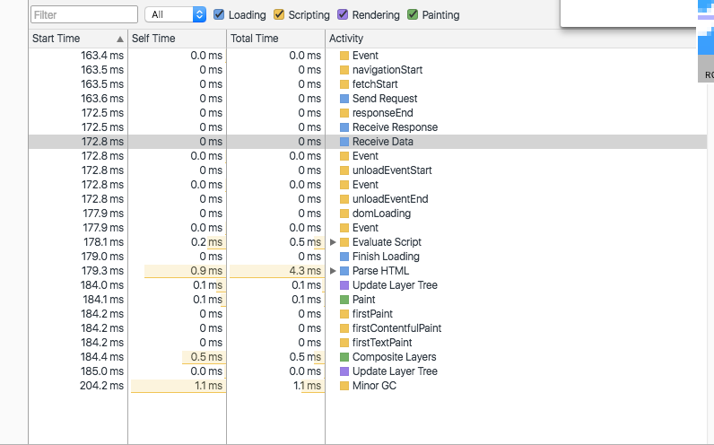
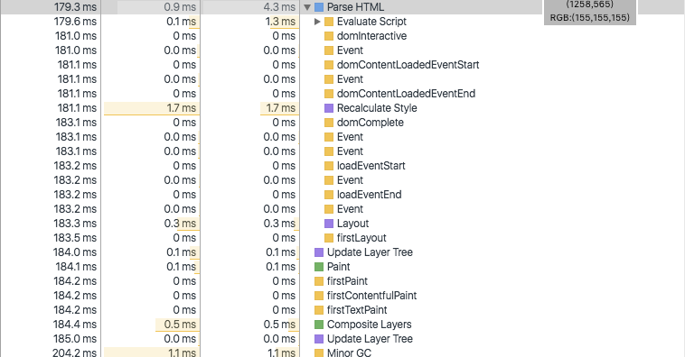
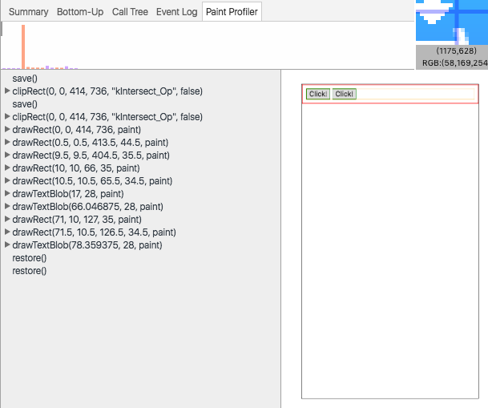

## 一次完整性能优化分析过程

做一次完整的性能分析需要具备什么呢？

- 基础知识
- 工具

这是我准备的：

- [浏览器基础知识--英文版](http://www.html5rocks.com/en/tutorials/internals/howbrowserswork/) 
- [浏览器基础知识--粗暴版](https://github.com/ivanberry/all-on-browser)
- [浏览器Google版](https://developers.google.com/web/fundamentals/performance/critical-rendering-path/render-tree-construction?hl=en)

- [工具](https://developer.chrome.com/devtools/docs/timeline)

了解这些后，我们就可以开工了，当然你不需要成为这些知识的专家，这个还是有点难度的。

### 数据收集

没有数据，我们直接说，优化，优化什么的，是没有什么说服力的，因此，首先要有数据收集的方法，而Google Chrome刚好给我们提供了非常好用的工具--Timeline.

工具面板的话，自己玩弄一下就差不多了，具体的应用我们在实践中出真知：

建议： 

- 隐身模式测试
- 录制尽可能短
- 避免多余操作
- 使用快捷键

数据录制，正式开始:boom:,好了，数据已经收集好了，接下来我们应该操作一下数据了。

### 数据分析

想要优化页面的加载或者呈现速度，我们首先需要的了解，浏览器是怎么呈现我们页面的，大致的流程是：

我们用来测试的页面很简单，元素节点也不多，且看看完成页面加载的整个过程，都发生了些什么使用吧！

简单说一下：

- `beforeunload`: 发生在unload之前
- `navigationStart`: Web API--PerformanceTiming.navigationStart
- `fetchStart`：同上，也是性能分析的接口
- `Send Request`: 请求发送
- `responseEnd`: 还是性能分析的接口
- `Receive Response`: 接收服务器请求响应
- `Receive Data`: 接收请求数据
- `pagehide`: 
- `unloadEventStart`：性能分析接口
- `unload`：unload事件
- `unloadEventEnd`：性能分析接口
- `domLoading`：
- `readystatechange`：文档`readyState`状态发生时触发的事件
- `Evaluate Script`：脚本审查-包含脚本的编译
- `Finish Loading`：

以上是Google Chrome在我们正式开始处理文档前的一些不走，了解下具有一定的意义，接下来是我们真正关心的：

对应我们文档呈现的主要过程来看图，其实已经很明显了，最重要的是自己搞个简单的页面测试一番。

最后一个`Minor GC`是垃圾回收。

要掌握这些还是以上，要自己实践去...:boom:

多说一句，我例子中的代码最开始是内联的样式文件，所以没有`Parse Stylesheet`的过程。

:boom: :boom: :boom:

